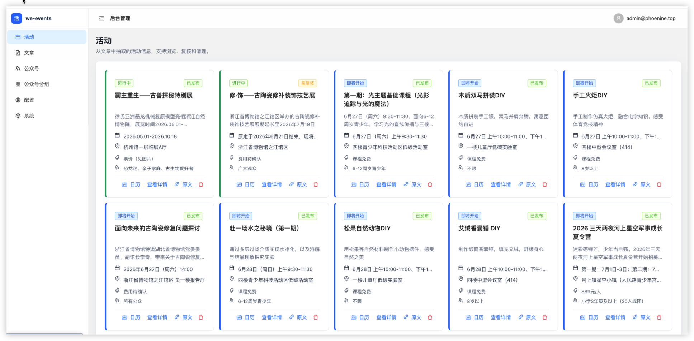

# we-events

we-events 是一个面向微信公众号内容采集和活动信息整理的 Web 应用。项目可以维护公众号来源、采集公众号文章、保存文章图片，并从文章内容中抽取活动信息。

项目由 FastAPI 后端、React 管理前端和 Supabase 数据存储组成。



## 功能

- 用户登录与资料管理
- 微信公众号搜索与管理
- 公众号分组与定时采集
- 文章采集、图片入库、清理和批量删除
- 活动信息抽取与活动管理
- 系统配置和运行状态管理页面

## 技术栈

- 后端：Python 3.12、FastAPI、Uvicorn、Supabase、Playwright
- 前端：React 18、Vite、TypeScript、Ant Design、TanStack Query
- 数据库与存储：Supabase
- 本地编排：Docker Compose

## 目录结构

```text
.
├── backend/                 # FastAPI 后端服务
├── frontend/                # React + Vite 前端
├── supabase/                # Supabase schema、RLS、函数、迁移和本地配置
├── docker-compose.yaml      # 本地 backend/frontend 编排
├── validate.sh              # 项目校验脚本
└── .github/workflows/       # CI 镜像构建流程
```

## 环境要求

- Python 3.12+
- uv
- Node.js 20+
- pnpm
- Docker 和 Docker Compose
- Playwright 浏览器运行依赖

## 环境变量

创建 Docker Compose 使用的根目录环境文件：

```bash
cp .env.local.example .env.local
```

如果使用 Supabase online：

```bash
cp .env.online.example .env.online
```

如果直接运行后端服务，创建后端环境文件：

```bash
cp backend/.env.example backend/.env
```

后端必需配置包括：

- `SUPABASE_URL`
- `SUPABASE_ANON_KEY`
- `SUPABASE_SERVICE_KEY`
- `USERNAME`
- `PASSWORD`
- `PORT`

前端环境变量见 `frontend/.env.example`。

## Supabase 初始化

`supabase/` 目录包含数据库表结构、RLS 策略、函数、迁移和存储桶相关配置。

启动本地 Supabase：

```bash
cd supabase
docker compose up -d
```

随后按 `supabase/README.md` 中的说明初始化 SQL 和 Storage 配置。

## 后端开发

安装依赖和 Playwright 浏览器：

```bash
cd backend
uv sync
uv run playwright install chromium
```

初始化默认用户：

```bash
uv run python init_sys.py
```

启动后端：

```bash
uv run python main.py
```

后端默认地址：

- API 前缀：`/api/v1/wx`
- Swagger UI：`http://localhost:38001/api/docs`
- ReDoc：`http://localhost:38001/api/redoc`

## 前端开发

安装依赖：

```bash
cd frontend
pnpm install
```

启动开发服务：

```bash
pnpm dev
```

Vite 开发服务会将 `/api` 请求代理到后端，代理配置见 `frontend/vite.config.ts`。

## Docker 启动

使用本地 Supabase 配置启动：

```bash
docker compose --env-file .env.local up --build
```

使用 Supabase online 配置启动：

```bash
docker compose --env-file .env.online up --build
```

默认端口：

- 后端：`http://localhost:38001`
- 前端：`http://localhost:30000`


测试账户:

- username: admin@phoenine.top
- password: WxHelper@2025!
